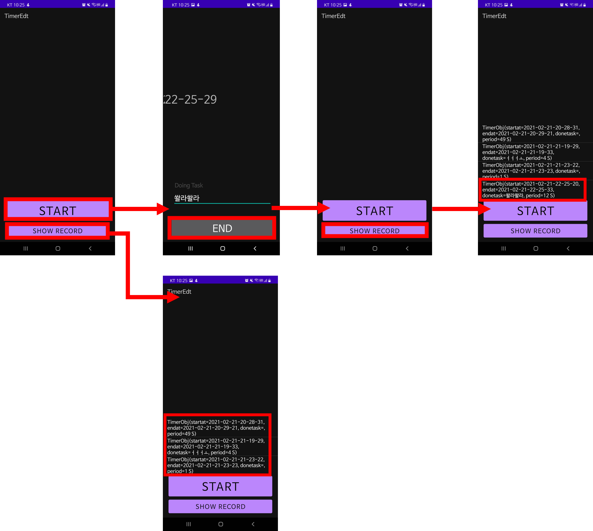

# How do I used Room DB

# Room DB 구성

[ DB 이름 ]   TimerDatabase

[ Table 이름 ] TimerObj

    [ col 이름] : [ data type ]

    startat : String  (* 기본키)

    endat : String

    donetask : String (null 가능)

    period : String (null 가능)

```java
@Entity(tableName = "TimerObj")
data class TimerObj(
    @PrimaryKey var startat: String,
    @ColumnInfo(name = "endat") var endat: String,
    @ColumnInfo(name = "donetask") var donetask: String?,
    @ColumnInfo(name = "period") var period: String?
)

@Dao
interface TimerObjDao {
    @Query("SELECT * FROM TimerObj")
    fun getAll(): List<TimerObj>
    @Insert
    fun insert(timerobj: TimerObj)
    @Update
    fun update(timerobj: TimerObj)
    @Delete
    fun delete(timerobj: TimerObj)
}

// Database
@Database(entities = arrayOf(TimerObj::class), version = 1)
abstract class TimerDatabase: RoomDatabase() {
    abstract fun TimerObjDao(): TimerObjDao

		// 다른 context에서 생성되어도 같은 DB를 사용하기 위함
    companion object {
        private var INSTANCE: TimerDatabase? = null

        fun getInstance(context: Context): TimerDatabase? {
            if (INSTANCE == null) {
                synchronized(TimerDatabase::class) {
                    INSTANCE = Room.databaseBuilder(context.applicationContext,
                            TimerDatabase::class.java, "rndns_timer.db")
                            .allowMainThreadQueries()
                            .build()
                }
            }
            return INSTANCE
        }
    }
}
```

# Workflow



Main 페이지에서 Start를 클릭하면,

Timer가 시작된다

Timer가 진행됨을 실시간으로 확인한다

하고있는 일을 적는다

End를 클릭한다

Main 페이지에서 Show Record를 클릭하면,

DB에 저장된 TimerObj를 확인한다

# Main 페이지 코드

```java
class MainActivity : AppCompatActivity() {
    lateinit var recordlist: ListView
    lateinit var startbtn: Button
    lateinit var showRecord: Button
    var db: TimerDatabase? = null

    override fun onCreate(savedInstanceState: Bundle?) {
        super.onCreate(savedInstanceState)
        setContentView(R.layout.activity_main)

        recordlist = findViewById(R.id.recordlist)
        startbtn = findViewById(R.id.startbtn)
        showRecord = findViewById(R.id.showRecord)

        // 클릭하면, TimerActivity로 이동
        startbtn.setOnClickListener {
            val intent = Intent(this, TimerActivity::class.java)
            startActivity(intent)
        }
        // 클릭하면, DB를 연결하여 저장된 List<TimerObj> 출력
        showRecord.setOnClickListener {
            db = TimerDatabase.getInstance(this)
            var timerlist: List<TimerObj>? = db?.TimerObjDao()?.getAll()

            // Log를 통해 확인
            Log.d("MA10001", " - is DB open: "+db?.isOpen)
            Log.d("MA10001", " - timer list: "+timerlist.toString())

            // 화면 상단의 리스트뷰에서 확인
            if (!timerlist?.isEmpty()!!) {
                val adapter = ArrayAdapter<TimerObj>(this, android.R.layout.simple_list_item_1, timerlist!!)
                recordlist.setAdapter(adapter)
                adapter.notifyDataSetChanged()
            } else {
                Toast.makeText(this, "There's no timer data!", Toast.LENGTH_LONG)
            }
        }
    }
}
```

db = TimerDatabase.getInstance(this)

View의 클릭리스너 내에서 Room DB를 사용하였다.

this 키워드로 TimerDatabase.getInstance() 함수에 context를 전달하여 DB를 생성하였다.

var timerlist: List<TimerObj>? = db?.TimerObjDao()?.getAll()

TimerObj 테이블의 모든 데이터를 가져와 List에 저장하였다.

DB가 null일 수도 있기 때문에 객체 뒤에 ?가 붙었다.

if (!timerlist?.isEmpty()!!)

빈 List가 아니라면 { } 를 수행한다.

List.isEmpty()는 빈 리스트라면 True를 반환한다. 앞에 붙은 !는 not이라는 의미라 결론적으로 False를 반환한다.

객체 뒤에 !!는 반드시 null이 아니니 강제로 진행하라는 의미다.

val adapter = ArrayAdapter<TimerObj>(this, android.R.layout.simple_list_item_1, timerlist!!)

ListView를 설정하기 위해 ArrayAdapter를 사용하였다.

List<TimerObj>를 ListView와 연결하므로 List요소는 <TimerObj>로 설정하였다.

ArrayAdapter의 매개변수는 this로 Context, simple_list_item_1으로 보여줄 스타일, timerlist로 보여줄 데이터 리스트를 지정하였다.

recordlist.setAdapter(adapter)

ListView를 설정하기 위해 setAdapter() 함수를 사용한다.

adapter.notifyDataSetChanged()

notifyDataSetChanged() 함수를 통해 ListView의 Adapter가 변경됨을 알렸다.

# Timer 페이지 코드

```java
class TimerActivity : Activity() {
    lateinit var doingtask: EditText
    lateinit var takingtime: TextView
    lateinit var endbtn: Button

    var db: TimerDatabase? = null
    lateinit var timeformat: DateTimeFormatter

    lateinit var startAt: String
    lateinit var endAt: String
    lateinit var donetask: String
    var period: Int = 0

    @RequiresApi(Build.VERSION_CODES.O)
    override fun onCreate(savedInstanceState: Bundle?) {
        super.onCreate(savedInstanceState)
        setContentView(R.layout.activity_timer)

        doingtask = findViewById(R.id.doingtask)
        takingtime = findViewById(R.id.takingtime)
        endbtn = findViewById(R.id.endbtn)

        db = TimerDatabase.getInstance(this)
        timeformat = DateTimeFormatter.ofPattern("yyyy-MM-dd-HH-mm-ss")

        // 현재 시각을 startAt에 저장
        startAt = LocalDateTime.now().format(timeformat)
        Thread(Runnable {
            kotlin.run {
                while(true) {
                    // 화면에서 증가하는 period 값 확인
                    takingtime.text = period.toString()
                    Thread.sleep(1000)
                    period += 1
                }
            }
        }).start()

        endbtn.setOnClickListener {
            // 현재 시각을 endAt에 저장, EditText의 값을 donetask에 저장
            endAt = LocalDateTime.now().format(timeformat)
            donetask = doingtask.text.toString()

            // DB에 해당 timerobj를 저장
            db?.TimerObjDao()?.insert(TimerObj(startAt, endAt, donetask, getPeriod(period)))

            // Log를 통해 삽입된 timerobj 확인
            Log.d("TA10001", " - inserted timer obj: ${startAt}, ${endAt}, ${doingtask}, ${takingtime}")

            // MainActivity로 이동
            val intent = Intent(this, MainActivity::class.java)
            startActivity(intent)
            finish()
        }
    }

    // sec값을 "$hour H $min M $sec S" 형태로 반환
    fun getPeriod(delayedsec: Int): String {
        var tmp = delayedsec
        var sec = tmp%60
        if (delayedsec < 60) return "${sec}S"

        tmp -= sec
        var min = tmp/60
        if (delayedsec < 3600) return "${min}M ${sec}S"

        tmp -= 60*min
        var hour = tmp/24
        return "${hour}H ${min}M ${sec}S"
    }
}
```

db = TimerDatabase.getInstance(this)

onCreate() 내에서 this 키워드로 DB를 생성하였다.

db?.TimerObjDao()?.insert(TimerObj(startAt, endAt, donetask, getPeriod(period)))

Button 클릭 리스너 내에서 TimerObj를 삽입하였다.

getPeriod() 함수를 통해 원하는 데이터 형태로 변환하였다.